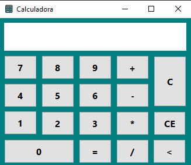

-----

  

### Calculadora

Calculadora simples desenvolvida em Pascal utilizando Lazarus.

Este é um projeto antigo, desenvolvido durante meus estudos iniciais
de programação, com o objetivo de praticar os conceitos básicos da
linguagem.

### Funcionalidades

- Soma
- Subtração
- Multiplicação
- Divisão
- Limpar tela
- Limpar todos os valores
- Voltar para o preenchimento do primeiro número

### Melhorias futuras

Por ser um projeto inicial, algumas funcionalidades poderiam ser
adicionadas em uma versão futura:

- Tratamento de divisão por zero;
- Suporte a números decimais;
- Melhor tratamento das entradas do usuário.

  

-------
